# ScaleBFM-Loco

An **unofficial engineering fork** of [ScaleBFM](https://github.com/zengweishuai/ScaleBFM)
for Unitree G1: AMASS retargeting, Transformer/PPO training, sparse 3D body-target
control and physical interaction demos.

[Demo gallery](docs/DEMO_GALLERY.md) · [GUI guide](docs/AMASS_MOTION_BROWSER.md) ·
[Technical route](docs/AMASS_TO_SCALEBFM_TECHNICAL_ROUTE.md) ·
[Upstream project](https://scalebfm.github.io/)

## Demos

All recordings use the **official pretrained policy**, not a newly trained local
manipulation network. GIFs play inline at original speed; every entry links to
the captioned video and unchanged raw MP4. Full results and checksums are in the
[gallery](docs/DEMO_GALLERY.md).

### Native IsaacLab / PhysX

| Box lift, hold and replace | Squat and stand |
| :--: | :--: |
| <a href="docs/media/isaac-lift-single-state-20260910.mp4"></a> | <a href="docs/media/isaac-motion-squat-20260910.mp4">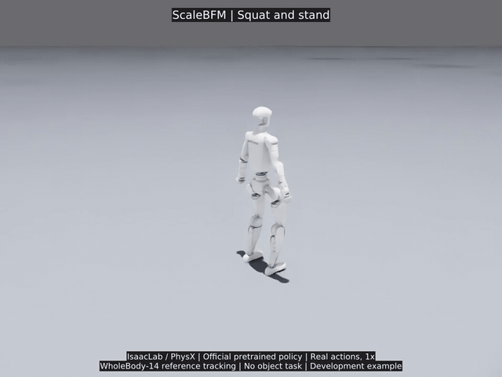</a> |
| [GIF](docs/media/isaac-lift-single-state-20260910.gif) · [MP4](docs/media/isaac-lift-single-state-20260910.mp4) · [Raw](docs/media/isaac-lift-single-state-20260910-raw.mp4) | [GIF](docs/media/isaac-motion-squat-20260910.gif) · [MP4](docs/media/isaac-motion-squat-20260910.mp4) · [Raw](docs/media/isaac-motion-squat-20260910-raw.mp4) |

| Cha-cha | Waltz |
| :--: | :--: |
| <a href="docs/media/isaac-motion-chacha-20260910.mp4">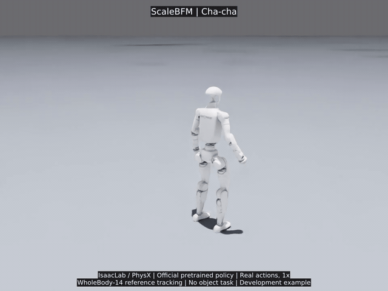</a> | <a href="docs/media/isaac-motion-waltz-20260910.mp4">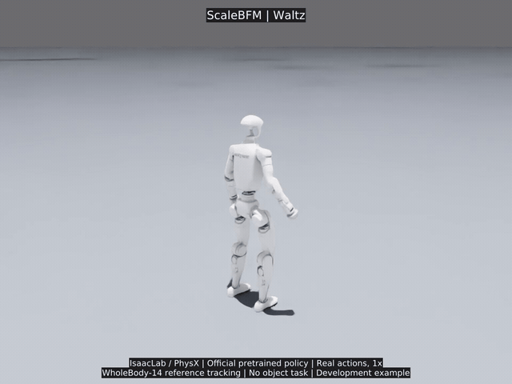</a> |
| [GIF](docs/media/isaac-motion-chacha-20260910.gif) · [MP4](docs/media/isaac-motion-chacha-20260910.mp4) · [Raw](docs/media/isaac-motion-chacha-20260910-raw.mp4) | [GIF](docs/media/isaac-motion-waltz-20260910.gif) · [MP4](docs/media/isaac-motion-waltz-20260910.mp4) · [Raw](docs/media/isaac-motion-waltz-20260910-raw.mp4) |

| Walk, turn and return | Walk and reach low (empty-handed) |
| :--: | :--: |
| <a href="docs/media/isaac-motion-turn-20260910.mp4">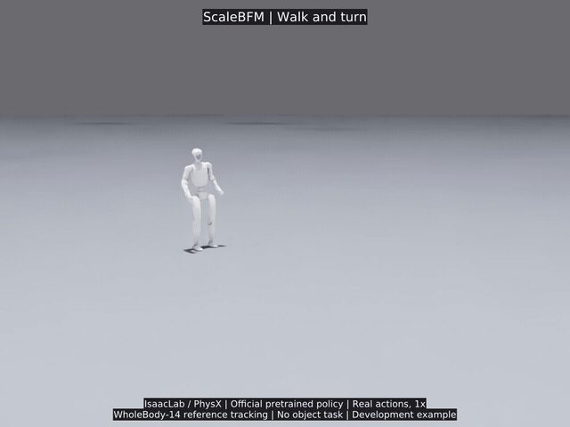</a> | <a href="docs/media/isaac-motion-reach-low-20260910.mp4">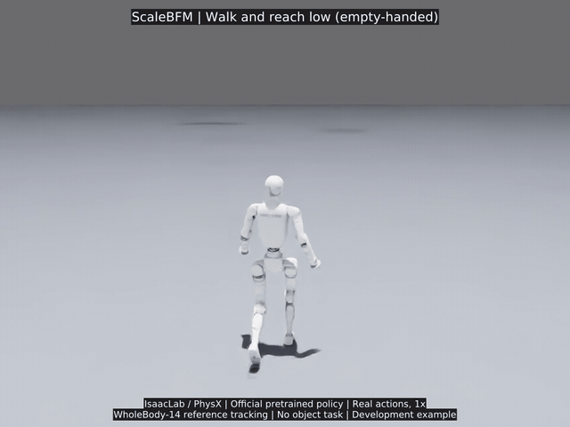</a> |
| [GIF](docs/media/isaac-motion-turn-20260910.gif) · [MP4](docs/media/isaac-motion-turn-20260910.mp4) · [Raw](docs/media/isaac-motion-turn-20260910-raw.mp4) | [GIF](docs/media/isaac-motion-reach-low-20260910.gif) · [MP4](docs/media/isaac-motion-reach-low-20260910.mp4) · [Raw](docs/media/isaac-motion-reach-low-20260910-raw.mp4) |

The physical **1 kg box lift** reached **10.19 cm** clearance, held for **2.02 s**
and finished with **1.78 cm** XYZ placement error. This is one initial-state pass,
not walking carry. [Lift evidence and control explanation](docs/ISAAC_BOX_LIFT_DEMO_20260910.md).
The other five clips are body-motion tracking; low reaching is **empty-handed**.

### 3D target control — MuJoCo

| Standing 3D wrist targets | Movement with changing wrist height |
| :--: | :--: |
| <a href="docs/media/synthetic-wrist-control-vr3-20260909.mp4">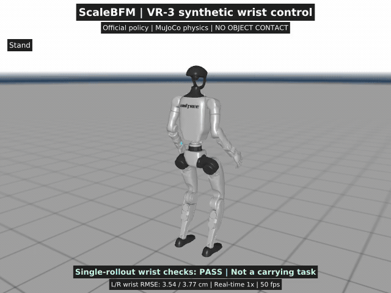</a> | <a href="docs/media/synthetic-move-wrists-20260909.mp4">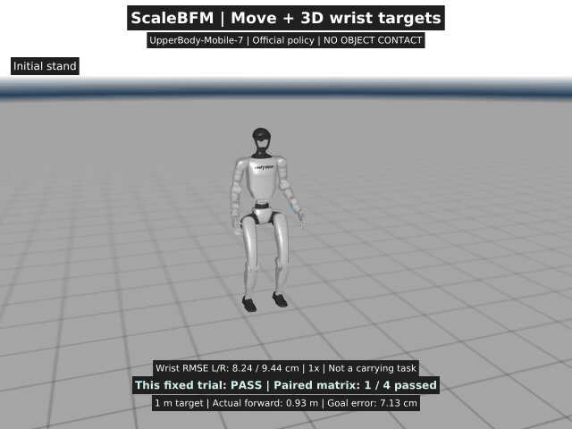</a> |
| [GIF](docs/media/synthetic-wrist-control-vr3-20260909.gif) · [MP4](docs/media/synthetic-wrist-control-vr3-20260909.mp4) · [Raw](docs/media/synthetic-wrist-control-vr3-20260909-raw.mp4) | [GIF](docs/media/synthetic-move-wrists-20260909.gif) · [MP4](docs/media/synthetic-move-wrists-20260909.mp4) · [Raw](docs/media/synthetic-move-wrists-20260909-raw.mp4) |

Standing control follows pelvis/wrist XYZ and orientation targets. The moving
preview combines forward travel with changing wrist height; only **1/4** paired
development cases passed. Neither clip demonstrates object carrying.

<details>
<summary>Earlier MuJoCo body-motion recordings — 3 complete clips</summary>

Same motion types as the native demos above, retained for comparison; not three
additional learned skills.

| Earlier squat and stand | Earlier cha-cha | Earlier waltz |
| :--: | :--: | :--: |
| <a href="docs/media/motion-squat-20260909.mp4">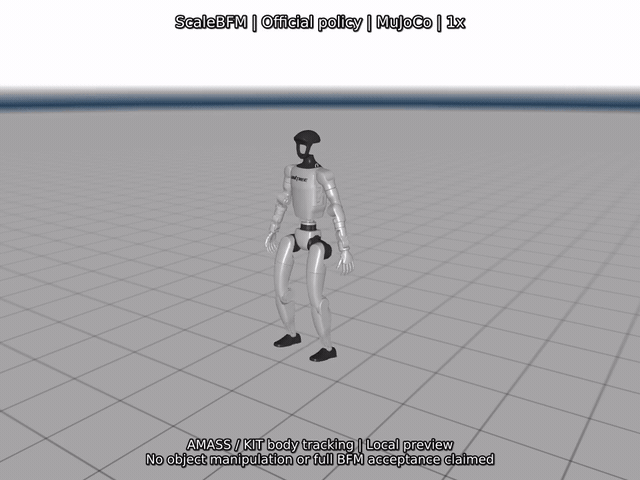</a> | <a href="docs/media/motion-chacha-20260909.mp4">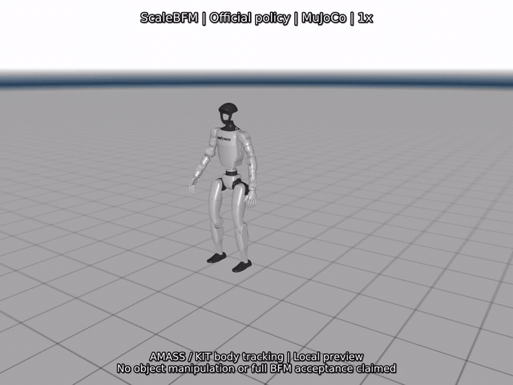</a> | <a href="docs/media/motion-waltz-20260909.mp4">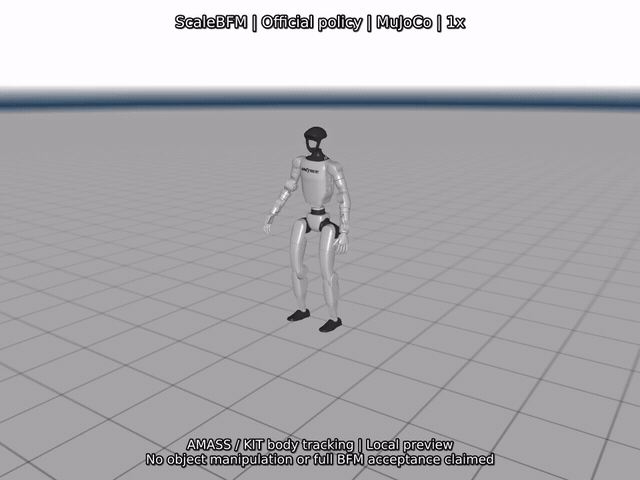</a> |
| [GIF](docs/media/motion-squat-20260909.gif) · [MP4](docs/media/motion-squat-20260909.mp4) · [Raw](docs/media/motion-squat-20260909-raw.mp4) | [GIF](docs/media/motion-chacha-20260909.gif) · [MP4](docs/media/motion-chacha-20260909.mp4) · [Raw](docs/media/motion-chacha-20260909-raw.mp4) | [GIF](docs/media/motion-waltz-20260909.gif) · [MP4](docs/media/motion-waltz-20260909.mp4) · [Raw](docs/media/motion-waltz-20260909-raw.mp4) |

</details>

<details>
<summary>Development failures — playable evidence, not accepted tasks</summary>

| Box push — strict task FAIL | Earlier box lift — FAIL |
| :--: | :--: |
| <a href="docs/media/loco-push-20260909.mp4">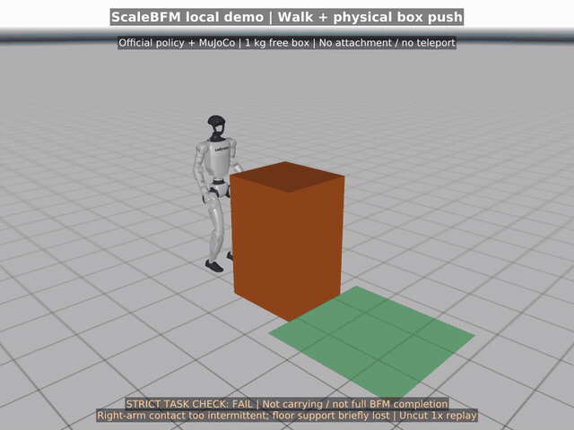</a> | <a href="docs/media/isaac-lift-balanced-failed-20260910.mp4">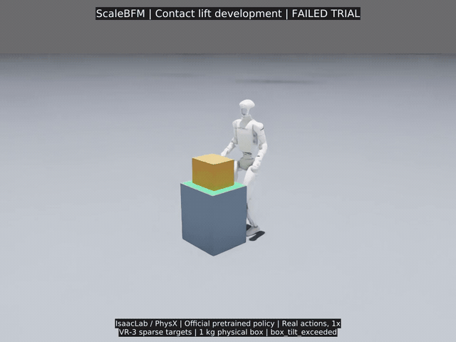</a> |
| [GIF](docs/media/loco-push-20260909.gif) · [MP4](docs/media/loco-push-20260909.mp4) · [Raw](docs/media/loco-push-20260909-raw.mp4) | [GIF](docs/media/isaac-lift-balanced-failed-20260910.gif) · [MP4](docs/media/isaac-lift-balanced-failed-20260910.mp4) · [Raw](docs/media/isaac-lift-balanced-failed-20260910-raw.mp4) |

The push trial passed **17/19** checks but failed continuous right-wrist contact
and floor support. The earlier lift trial stopped on excessive box tilt and did
not lift clear of the table. Original failure captions are retained.

</details>

**Control boundary:** no vision input. The box-lift planner reads simulated object
pose/contact feedback and sends pelvis/wrist targets to the BFM; learned joint
actions and the simulator produce the motion. Multi-initial-state acceptance,
walking carry and hardware calibration remain pending.

## Local AMASS end-to-end workflow

- **Pipeline:** AMASS → ScaleRetarget → ScaleTrack training/evaluation → ScaleBridge.
- **Data:** 7,174 training clips (including 2,927 KIT additions); 1,751 validation clips.
- **Model:** Transformer actor-critic + PPO, not CVAE. Official pretrained weights remain the baseline.
- **Training status:** local fine-tuning runs completed, but no candidate has established a consistent improvement over the official baseline.
- **Setup:** reuse an existing IsaacLab environment; datasets, body models, robot assets and checkpoints are obtained separately.

[Workflow and setup](docs/AMASS_TO_SCALEBFM_TECHNICAL_ROUTE.md) ·
[Data / KIT summary](docs/KIT_INGESTION_20260907.md) ·
[Evaluation record](docs/BEHAVIOR_LONG_EVALUATION_20260908.md)

Open the native GUI after supplying the required local assets and motion index:

```bash
BFM_ISAAC_PYTHON=/path/to/existing/isaaclab/bin/python bash scripts/open_motion_browser.sh
```

[Motion switching](docs/AMASS_MOTION_BROWSER.md) · [Online 3D targets](docs/ONLINE_VR3_CONTROL.md) ·
[Capability status](docs/BFM_CAPABILITY_MATRIX.md)

## Source and publication scope

Source, tests, documentation and the rendered demo gallery are included. Data,
body models, robot meshes, weights, SDK binaries and full experiment logs are not.
The gallery is a non-commercial research demonstration, not a complete ScaleBFM
reproduction or a blanket license for third-party assets.
[Runtime setup](docs/SOURCE_SNAPSHOT.md) · [Media sources](docs/MEDIA_SOURCES.md) ·
[Third-party notices](THIRD_PARTY_NOTICES.md) · [Contributing](CONTRIBUTING.md).

## ScaleRetarget

**ScaleRetarget** is the motion-retargeting toolkit used to prepare human motion
data for ScaleBFM. It converts motion from common mocap representations into
robot joint trajectories and currently provides a complete configuration for the
Unitree G1 humanoid.


The retargeting code and documentation are available in
**[ScaleRetarget](ScaleRetarget/README.md)**. See the guide for supported datasets,
environment setup, motion retargeting, dataset preparation, and visualization.

Retargeting media are available in the
[upstream demonstrations](https://github.com/zengweishuai/ScaleBFM/tree/abd6f17c02fe0baabc14709feb8d9ea4959aa621/ScaleRetarget#readme),
not as recordings produced by this fork.

## ScaleTrack

**ScaleTrack** provides the foundational implementation of the BFM pretraining
pipeline. It packages retargeted robot trajectories into motion datasets and
pretrains BFMs through motion tracking in IsaacLab using the bundled RSL-RL
implementation. It currently provides a complete pretraining pipeline for the
Unitree G1 humanoid, including single- and multi-GPU training, policy playback, and export.

The training code and documentation are available in
**[ScaleTrack](ScaleTrack/README.md)**. See the guide for environment and robot
asset setup, motion preparation and packaging, policy training, playback, and
export.

Tracking media remain in the
[upstream demonstrations](https://github.com/zengweishuai/ScaleBFM/tree/abd6f17c02fe0baabc14709feb8d9ea4959aa621/ScaleTrack#readme).

## ScaleBridge

**ScaleBridge** provides a unified Sim2Sim and Sim2Real deployment framework for
Behavior Foundation Models on humanoid robots. It enables a seamless transition
from policy evaluation in MuJoCo to deployment on physical robots.

The deployment code and documentation are available in
**[ScaleBridge](ScaleBridge/README.md)**. See the guide for environment setup,
robot controller configuration, policy evaluation, real-world deployment, and
migration instructions.

Deployment media remain in the
[upstream demonstrations](https://github.com/zengweishuai/ScaleBFM/tree/abd6f17c02fe0baabc14709feb8d9ea4959aa621/ScaleBridge#readme).

## Citation

If you find the upstream work useful, please cite its paper and previous work
that introduced the BFM framework:

```bibtex
@article{zeng2026scaling,
  title   = {Scaling Behavior Foundation Model for Humanoid Robots},
  author  = {Zeng, Weishuai and Yin, Kangning and Niu, Xiaojie and
             Lu, Shunlin and Zhong, Weixiang and Chen, Jiahe and
             Jia, Feiyu and Chen, Xiao and Wang, Zirui and Xu, Furui and
             Zhou, Ming and Li, Kailin and Zhang, Weinan and Wang, He and
             Yi, Li and Lin, Dahua and Pang, Jiangmiao and Wang, Jingbo},
  journal = {arXiv preprint arXiv:2607.15163},
  year    = {2026}
}
```

```bibtex
@article{zeng2025behavior,
  title   = {Behavior Foundation Model for Humanoid Robots},
  author  = {Zeng, Weishuai and Lu, Shunlin and Yin, Kangning and
             Niu, Xiaojie and Dai, Minyue and Wang, Jingbo and Pang, Jiangmiao},
  journal = {arXiv preprint arXiv:2509.13780},
  year    = {2025}
}
```
