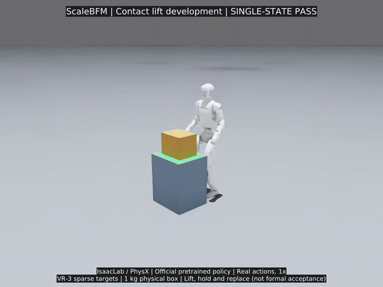

# Published native box-lift demonstration

[Captioned MP4](isaac-lift-single-state-20260910.mp4) ·
[Uncaptioned MP4 source](isaac-lift-single-state-20260910-raw.mp4) ·
[Original archival receipt and SHA-256 hashes](isaac-lift-single-state-20260910.json)

The official pretrained BFM plus a VR-3 target planner controls a real dynamic
1 kg box in native IsaacLab / PhysX. No vision input, attachment, post-reset
object animation, or extra lifting force. This is a single-initial-state
development pass, not walking carry or a fully reproduced ScaleBFM system.

The MP4s retain all 971 physical control frames, 960x720 at 50 fps, 19.42 seconds
at original speed. The GIF is the complete 640x480 / 10 fps preview (19.4 seconds
after frame-time quantization). Full decode checks and five sampled visual checks
were completed locally; no full manual frame-by-frame review is claimed.

Four media files total 16,179,655 bytes. They are unmodified copies of the local
archive. Its JSON records the earlier local archival operation and therefore
retains `publication_performed: false`; publication is recorded by the later Git
commit, not by rewriting old evidence. Full local trajectories, weights, robot
assets, data and other videos are not bundled. See the
[source-snapshot scope](../SOURCE_SNAPSHOT.md) and
[third-party notices](../../THIRD_PARTY_NOTICES.md).
